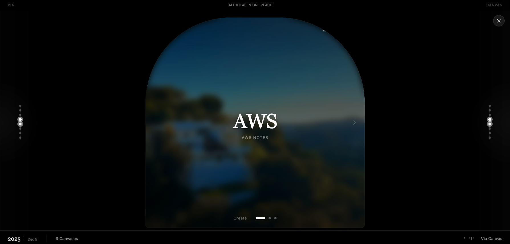
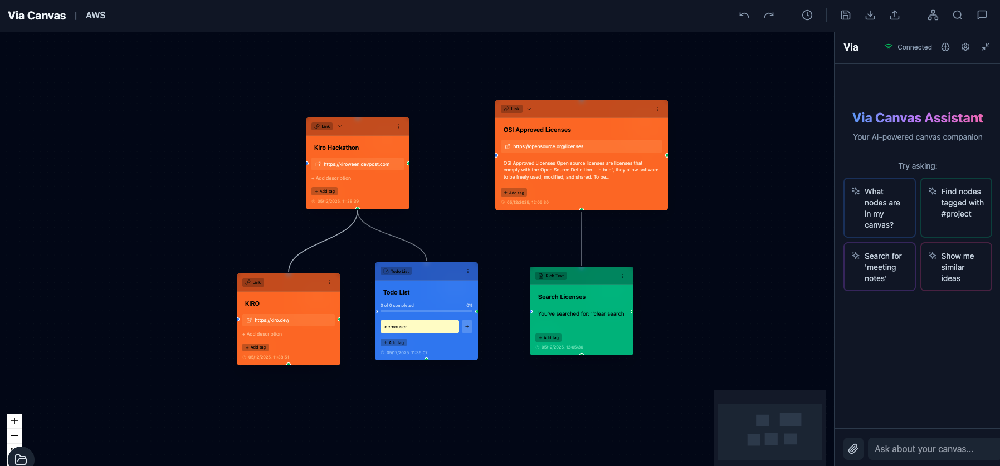

# Via Canvas

**An AI-Powered Infinite Canvas for Knowledge Management**

Via Canvas is an intelligent workspace that transforms how you capture, organize, and explore knowledge. Drop a URL in chat, and watch as AI automatically extracts content and creates beautifully organized cards on your canvas. No manual note-taking, no tedious organization—just natural conversation with AI that builds your knowledge graph in real-time.


---

## 📸 Screenshots

<div align="center">

### Canvas Manager


*Create and manage multiple canvases for different topics and projects*

---

### Infinite Canvas with AI Chat


*Chat with AI to create cards, extract URLs, and organize knowledge automatically*

---

### Temporal Timeline View


*Visualize your knowledge evolution over time with the temporal timeline view*

</div>

---

## ✨ Key Features

### 🎯 Conversational Capture
Chat with AI to create content—paste URLs, share ideas, or ask questions. AI automatically creates and organizes cards on your canvas.

### 🤖 Multi-Agent Intelligence
Powered by NVIDIA NIM (Llama 3.3 70B) with specialized agents for:
- **Content Extraction** - Smart URL parsing (docs, GitHub, YouTube)
- **Knowledge Graph** - Intelligent card placement and connections
- **Learning Assistant** - 8 built-in skills (Deep Research, Find Gaps, Explain Like I'm 5)
- **Background Intelligence** - Auto-generates questions, extracts todos, detects deadlines

### 📝 5 Card Types
- **Rich Text** - Markdown notes with syntax highlighting
- **Todo Lists** - Task management with progress tracking
- **Videos** - Embedded YouTube players
- **Links** - Bookmarked resources with descriptions
- **Reminders** - Date/time-based alerts

### 🎨 Visual Organization
- **3 Auto-Layout Algorithms** - Tree (Dagre), Force-Directed (D3), Circular
- **Smart Positioning** - Children arrange in circles around parents
- **Collapse/Expand** - Focus on specific branches
- **Parent-Child Movement** - Drag parents, children follow

### 🔍 Powerful Search
- **Keyword Search** - Find by text
- **Similarity Search** - TF-IDF semantic matching
- **Relationship Search** - Explore connections (1st, 2nd, Nth degree)

### � Knowlsedge Base (RAG)
- **Automatic Indexing** - All content indexed in Qdrant vector DB
- **Semantic Search** - Find by meaning, not just keywords
- **Context-Aware AI** - Responses grounded in your knowledge

---

## 🏗️ Architecture

```
┌─────────────────────────────────────────────────────────────┐
│  FRONTEND (React + Vite)                     Port 5173      │
│  • ReactFlow canvas • Zustand state • SSE streaming         │
└─────────────────────────────────────────────────────────────┘
                              ↓
┌─────────────────────────────────────────────────────────────┐
│  EXPRESS.JS BACKEND (TypeScript)             Port 3000      │
│  • Canvas CRUD • Chat proxy • Session management            │
└─────────────────────────────────────────────────────────────┘
                              ↓
┌─────────────────────────────────────────────────────────────┐
│  PYTHON AI SERVICE (FastAPI)                 Port 8000      │
│  • Strands agents • NVIDIA NIM • Canvas tools               │
└─────────────────────────────────────────────────────────────┘
                              ↓
┌─────────────────────────────────────────────────────────────┐
│  NVIDIA NIM API • PostgreSQL • Qdrant                       │
└─────────────────────────────────────────────────────────────┘
```

---

## 🚀 Quick Start

### Prerequisites

- **Node.js** 18+ and npm
- **Python** 3.10+
- **Docker** and Docker Compose
- **NVIDIA NIM API Key** ([Get one here](https://build.nvidia.com/))

### Installation

1. **Clone the repository**
```bash
git clone https://github.com/yourusername/via-canvas.git
cd via-canvas
```

2. **Set up environment variables**
```bash
cp .env.example .env
# Edit .env and add your NVIDIA_NIM_API_KEY
```

3. **Start databases**
```bash
docker-compose up -d
```

4. **Run database migrations**
```bash
# Run all migrations
for file in supabase/migrations/*.sql; do
  docker exec -i via-canvas-db psql -U viacanvas -d via_canvas < "$file"
done
```

5. **Install dependencies**
```bash
# Frontend & Express backend
npm install

# Python AI service
cd chat_service
pip install -r requirements.txt
cd ..
```

6. **Start all services**
```bash
# Terminal 1: Express backend
npm run server

# Terminal 2: Python AI service
cd chat_service
uvicorn app:app --reload

# Terminal 3: Frontend
npm run dev
```

7. **Open your browser**
```
http://localhost:5173
```

---

## 💡 Usage

### Creating Your First Canvas

1. Click **"New Canvas"** in the Canvas Manager
2. Give it a name (e.g., "Machine Learning")
3. Open the chat sidebar (Ctrl+K)

### Adding Content

**Drop a URL:**
```
User: "https://docs.python.org/tutorial"
AI: ✅ Created 8 cards from the URL
```

**Ask questions:**
```
User: "What's on my canvas?"
AI: You have 8 cards about Python tutorials...
```

**Grow knowledge:**
```
Right-click any card → "Grow"
AI extracts key concepts and creates child cards
```

### Keyboard Shortcuts

- `Ctrl+K` - Toggle chat sidebar
- `Tab` - Create child card
- `Enter` - Create sibling card
- `Ctrl+L` - Apply auto-layout
- `Ctrl+F` - Open search
- `Ctrl+D` - Duplicate cards
- `Delete` - Remove cards

---

## 🛠️ Technology Stack

### Frontend
- React 18.3 + TypeScript 5.5
- ReactFlow 11.11 (canvas engine)
- Zustand 5.0 (state management)
- TailwindCSS 3.4
- Vite 5.4

### Backend
- Express.js (TypeScript)
- FastAPI (Python)
- PostgreSQL 15
- Qdrant (vector database)

### AI
- NVIDIA NIM (Llama 3.3 70B)
- Strands agents framework
- NVIDIA embeddings (768-dim)

### Layout
- Dagre 0.8.5 (tree layout)
- D3-Force (force-directed)
- Custom circular arrangement

---

## 📁 Project Structure

```
ViaCanvas/
├── src/                    # React frontend
│   ├── components/         # UI components
│   ├── store/             # Zustand stores
│   ├── utils/             # Layout algorithms, search
│   └── lib/               # API clients
├── server/                # Express.js backend
│   └── src/routes/        # API routes
├── chat_service/          # Python AI service
│   ├── agents/            # Specialized AI agents
│   ├── tools/             # Canvas tools
│   ├── extractors/        # URL extractors
│   └── knowledge_base/    # RAG implementation
├── supabase/migrations/   # Database migrations
└── docker-compose.yml     # PostgreSQL + Qdrant
```

---

## 🎯 Use Cases

### 🎓 Students & Researchers
- Capture lecture notes and research papers
- Build study guides automatically
- Identify knowledge gaps
- Track citations and sources

### 💼 Knowledge Workers
- Organize project research
- Build personal knowledge bases
- Track action items and deadlines
- Connect ideas across domains

### 🚀 Creators & Writers
- Brainstorm and outline content
- Research topics deeply
- Track references and sources
- Develop complex narratives

### 🧠 Lifelong Learners
- Build learning paths
- Track progress over time
- Discover connections between topics
- Maintain a second brain

---

## 🗺️ Roadmap

### ✅ Phase 1: Foundation (Complete)
- Multiple card types
- Auto-layout algorithms
- Context menus & keyboard shortcuts
- Search functionality
- Chat sidebar with AI

### ✅ Phase 2: Intelligence (Complete)
- Smart URL extraction
- AI-powered "Grow" feature
- Intelligent card placement
- Automatic categorization
- Background intelligence agent

### 🚧 Phase 3: Advanced (In Progress)
- Multi-threaded conversations
- Knowledge base with RAG
- Code artifact generation
- Enhanced citations
- Workflow automation

### 🔮 Phase 4: Collaboration (Planned)
- Real-time collaboration
- Shared canvases
- Team workspaces
- Version control
- Export to multiple formats

---

## 🤝 Contributing

We welcome contributions! Please see [CONTRIBUTING.md](CONTRIBUTING.md) for guidelines.

### Development Setup

1. Fork the repository
2. Create a feature branch (`git checkout -b feature/amazing-feature`)
3. Commit your changes (`git commit -m 'Add amazing feature'`)
4. Push to the branch (`git push origin feature/amazing-feature`)
5. Open a Pull Request

---

## 📄 License

This project is licensed under the Apache 2.0 License - see the [LICENSE](LICENSE) file for details.

---

## �  Acknowledgments

- **NVIDIA NIM** for AI inference
- **Strands** for agent framework
- **ReactFlow** for canvas engine
- **Qdrant** for vector search
- **PostgreSQL** for data persistence

---

## 📧 Contact

**Project Status**: Beta (Functional MVP)  
**Looking For**: Contributors, Early Adopters, Feedback

---

## 🌟 Star History

If you find Via Canvas useful, please consider giving it a star! ⭐

---

*"The best way to predict the future is to invent it." — Alan Kay*

**Let's build the future of knowledge work together.**
